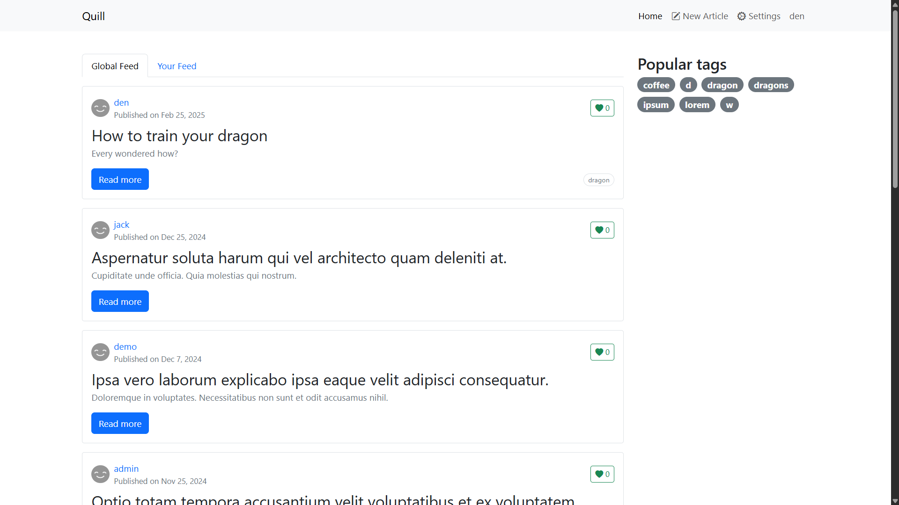
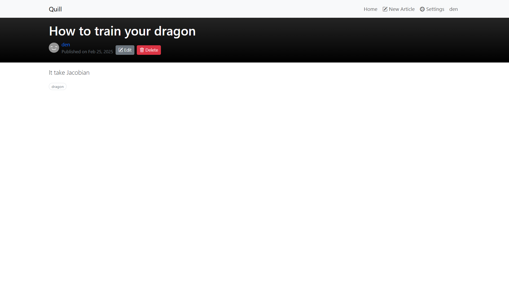
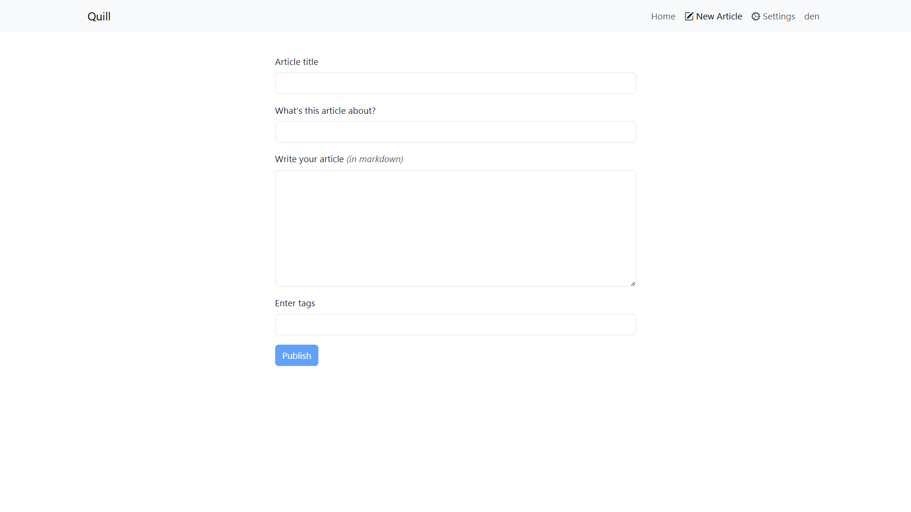
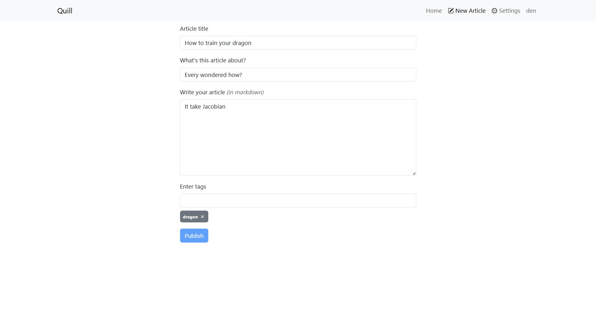
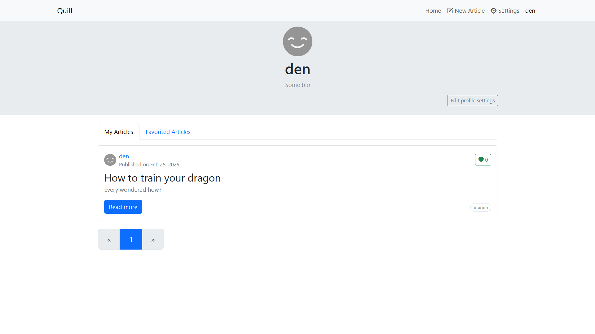
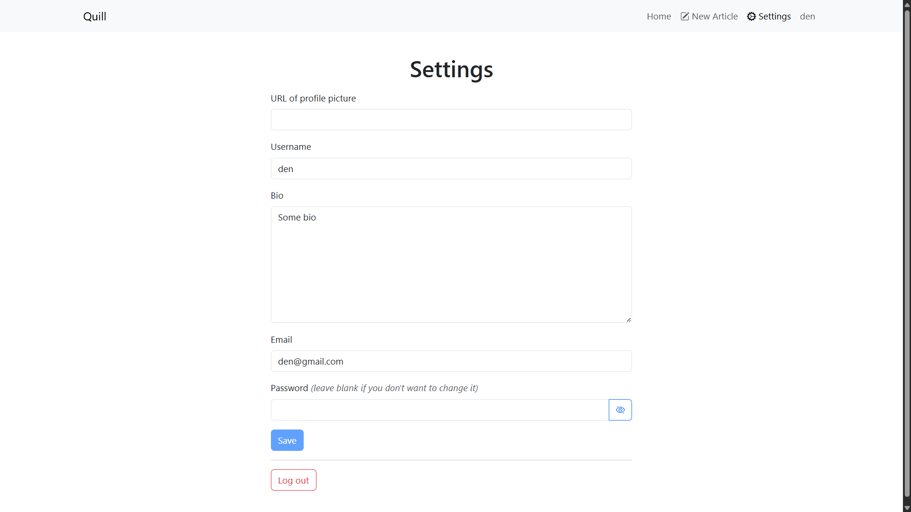
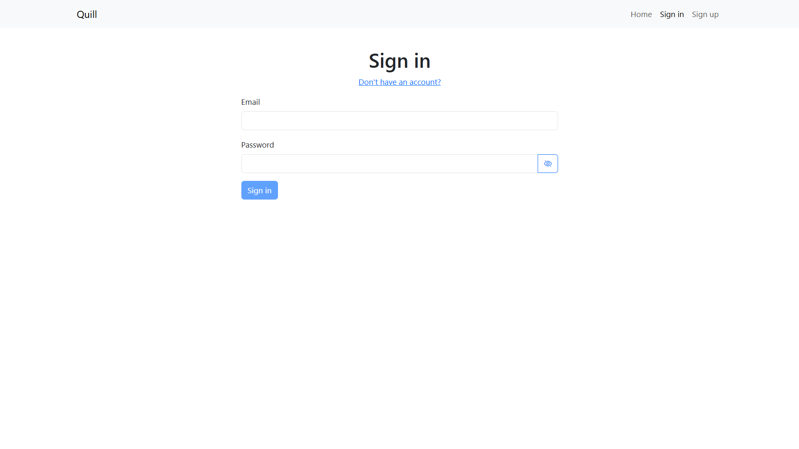
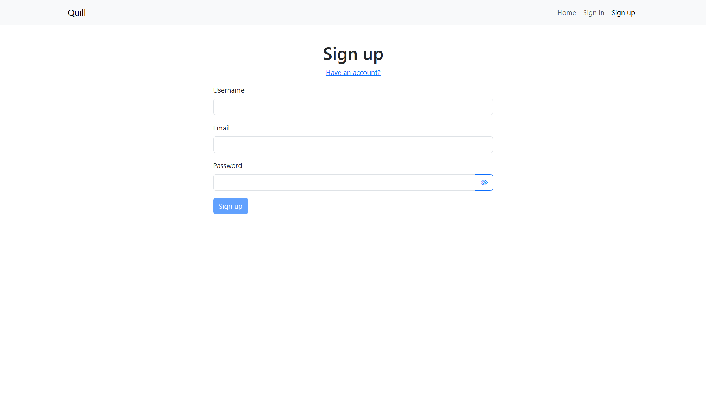

# Quill

A blog app built with Angular 18 and NgRx that allows users to create, edit and delete articles, like and favorite them, follow other writers and customize their profiles.

## Tech Stack

- [Angular 18](https://angular.dev/)
- [NgRx](https://ngrx.io/) for global state management
- [Bootstrap 5](https://getbootstrap.com/) for styling
- [Bootstrap Icons](https://icons.getbootstrap.com/) for icons
- [Ng Bootstrap](https://ng-bootstrap.github.io/) for UI components like `tooltip`, `modal`, `alert` and `pagination`
- [ngx-valdemort](https://ngx-valdemort.ninja-squad.com/) for validation error messages

## Get Started

### Requirements

- [Node.js](https://nodejs.org)
- [pnpm](https://pnpm.io/)
- [Docker Desktop](https://www.docker.com/products/docker-desktop/)

### Backend Installation

1. Clone the repository:

```bash
git clone https://github.com/gothinkster/koa-knex-realworld-example.git
```

2. Build and run the server with Docker:

```bash
docker compose up --build
```

> [!NOTE]
> To run the server again later, simply use `docker compose up`.

3. The server will now be running at http://localhost:3000.

### Frontend Installation

1. Clone and install the dependencies:

```bash
git clone https://github.com/extremum9/quill.git
cd quill
pnpm install
```

2. Start the development server:

```bash
npx ng serve
```

3. Open http://localhost:4200 in your browser.

## Running Tests

### Unit Tests

Run the unit tests using [Karma](https://karma-runner.github.io/latest/index.html):

```bash
ng test
```

### End-to-End (E2E) Tests

Run the end-to-end tests using [Cypress](https://www.cypress.io/#create):

```bash
ng e2e
```

## Screenshots

### Home page



### Article page



### New article page



### Edit article page



### Author page



### Settings page



### Login page



### Signup page


